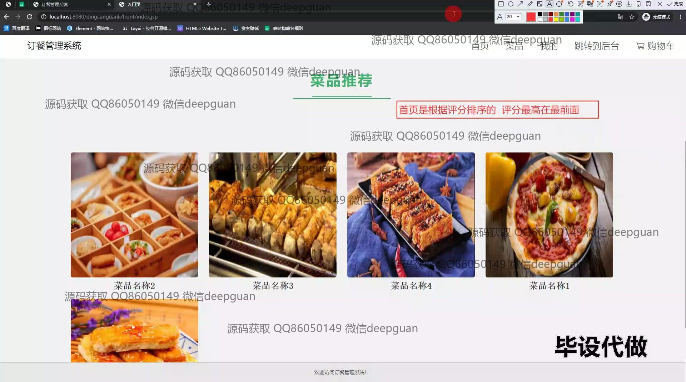

<h1 align="center">订餐管理系统+jsp</h1>

## 简介
订餐管理系统：角色分为管理员、用户；包括订单管理、会员管理、菜品管理、评价管理、数据统计等功能，支持在线点餐、地址选择、积分与折扣策略，优化用户体验和运营效率。    --计算机毕业设计源码；毕设源码；java毕业设计源码

## 联系方式

<h3 align="center">获取完整代码与数据库文件 + 微信：deepguan QQ: 86050149 QQ群: 783742310</h3>

<h3 align="center">可帮忙远程部署 包运行成功！提供远程部署、修改代码、设计文档指导、代码讲解等服务！</h3>

## 功能介绍（完整见运行截图）
管理员：基于SSM框架和JSP的订餐管理系统，管理员可以进行账号登录和注册，管理商品和用户信息。主要功能包括基础数据管理、会员等级管理、菜品和订单管理，通过修改会员等级类型和折扣策略，提高订单管理效率，实现会员制管理。此外，管理员能够查看和管理菜品评价，生成数据统计报表，完成销售数据的分析与管理，提高系统透明度和可操作性。

用户：用户可以通过界面登录和注册账号，选择配送地址和时间，浏览菜品推荐和菜单详情。用户在购物车中管理购买的菜品，完成在线订单支付。个人中心模块允许用户修改个人信息和配送地址，查看订单历史和收藏的菜品，便于管理个人数据和订单记录。系统设计便捷直观，旨在提升用户消费体验，实现轻松订餐。

## 运行截图

本代码来源于网络,仅供学习参考使用!

